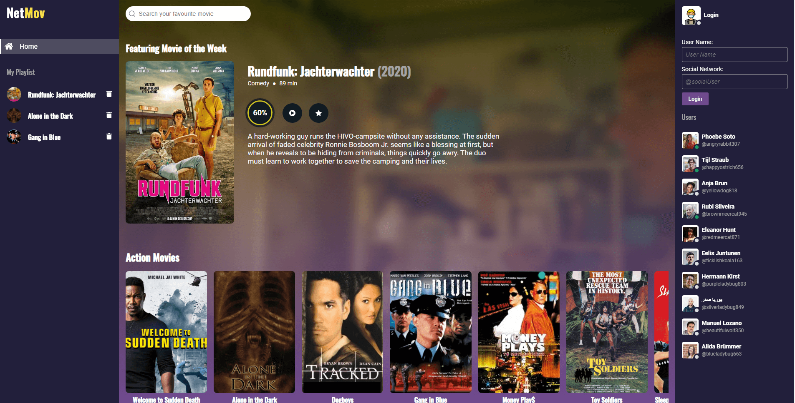
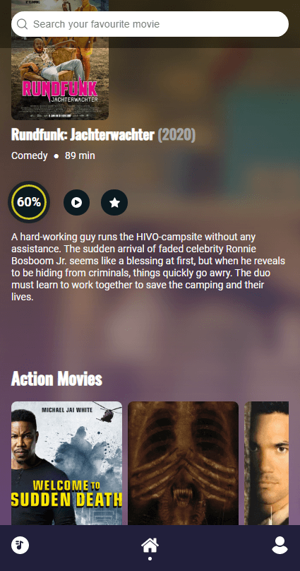
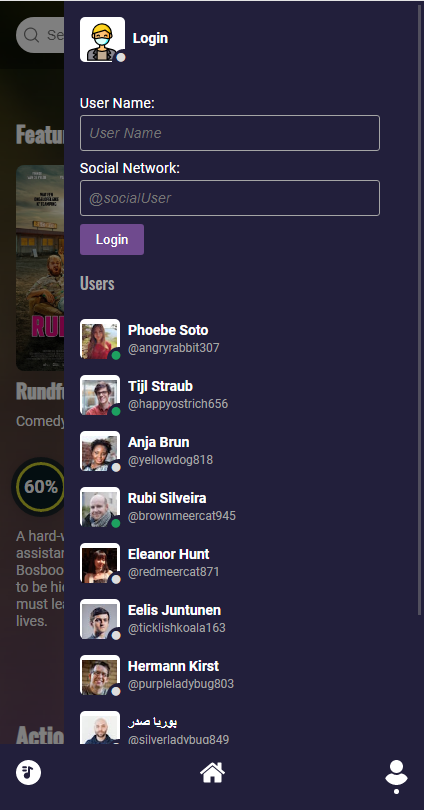

## Proyecto NetMov

_Proyecto app de películas. El mismo debe renderizar películas por categorías (acción, drama, comedia, animación), los datos de la película son guardados en una sesión utilizando sessionStorage. También se debe poder agregar películas a mi playlist, esta será guardada permanentemente con localStorage. Se renderiza una película principal la cuál es sustituída al momento de buscar o seleccionar una de las películas de las categorías. Vamos a poder iniciar sesión con un nombre de usuario y una red social, se presentará una lista de usuarios, los mismos pueden estar conectados o no, simulando una lista de usuarios real._

|  |  |  |
| ------ | ------ | ----- |

### Stack

La idea del stack del proyecto es utilizar hacer todo de manera nativa, es por esto que para este proyecto utilicé:

- HTML5
- CSS3
- Vanilla JavaScript
- Webpack
- Babel

### Entorno de desarrollo

Para levantar el proyecto localmente sigue los siguiente pasos

1. Clona el proyecto en tu máquina
2. Abre el proyecto desde la consola y ejecuta `npm install`
3. Cuando termine la instalación de los módulos necesarios ejecuta `npm run start`
4. Te debería abrir `localhost` en el puerto `3000`
